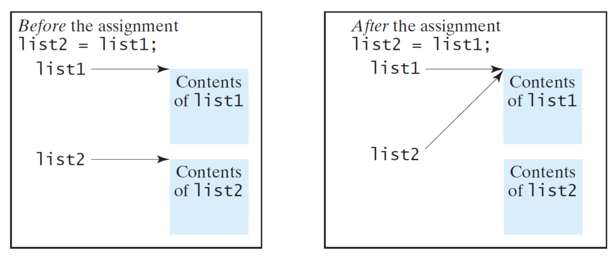

# INFS2609 Summary Notes

## Introduction to Programming

### Key Terms

- **Syntax**: a set of rules that must be strictly followed when writing a program
- **Compiler**: a program that translates a high-level language program into a separate machine language program
- **Interpreter**: a program that both translates and executes instructions written in a high-level programming language

### How Programs Run

1. Fetch next instruction
2. Decode instruction to determine the operation
3. Execute the operation
4. Repeat

### How Java Works

1. Source code is written in Java
2. Java compiler (`javac`) compiles source code into Java bytecode (`.class` file) – a middle language between Java and machine language
3. Java Virtual Machine (JVM) executes the class file
4. Class file is represented using a binary format that is independent of the hardware and operating system


## Thinking Programmatically

### Programming Errors

- **Syntax error**: detected by the compiler
- **Runtime error**: causes the program to abort
- **Logic error**: produces incorrect result


## Elementary Programming

### Integer Division

- `5 / 2` yields an integer `2`
- `5.0 / 2` yields a double `2.5`
- `5 % 2` yields `1` (the remainder of the division)

### Number Literals

- A literal is a value that appears directly in the program
- An integer literal can be assigned to an integer variable as long as it can fit into the variable. A compilation error would occur if the literal were too large for the variable to hold, e.g. `byte b = 1000` (because `1000` cannot fit inside `byte`).

### Numeric Type Conversion

- Implicit casting occurs when assigning a value to a numeric variable whose type supports a larger range of values (widening a type), e.g. `long` to `float`
- Explicit casting must be used when narrowing a type, e.g. `(int) 1.7`
- Casting does not change the variable being cast, it produces a new value – e.g. `d` is not changed in the following code:

  ```java
  double d = 4.5;
  int i = (int) d; // i is now 4 but d is still 4.5
  ```

### Character Data Type

- A character literal is enclosed in single quotation marks, e.g. `char letter = 'A'`
- Increment/decrement operators get the next/previous Unicode character
- Casting between `char` and numeric types:

  ```java
  int i = 'a'; // same as int i = (int) 'a';
  char c = 97; // same as char c = (char) 97;
  ```

- Output:

  ```
  97
  a
  ```

- Numeric operators with `char`:
  - A `char` operand is automatically cast into a number if the other operand is a number or a character
  - If the other operand is a `String`, the character is concatenated with the `String`

  ```java
  int i = '2' + '3';
  System.out.println("i is: " + i);
  // i is 101 because 2 is 50 and 3 is 51

  int j = 2 + 'a'; // (int) 'a' is 97
  System.out.println("j is: " + j); // j is 99

  System.out.println(j + " is the Unicode for
  character " + (char) j);
  // j is the Unicode for character c
  ```


## Loops

- In the case of do-while loop, the semicolon is needed to end the loop:

  ```java
  int i = 0;
  do {
      System.out.println("i is " + i);
      i++;
  } while (i < 10); // <-- semicolon
  ```

- Which loop to use:
  - A `for` loop may be used if the number of repetitions is known, as, for example, when you need to print a message 100 times
  - A `while` loop may be used if the number of repetitions is not known, as in the case of reading the numbers until the input is 0
  - A `do-while` loop can be used to replace a while loop if the loop body has to be executed before testing the continuation condition


## Methods

### Definition

- **Method**: a collection of statements that are grouped together to perform an operation
- **Method signature**: combination of the method name and the parameter list

  ```java
  public int max(int a, int b)
  //         <--------------->
  //              method
  //             signature
  ```

  These aren't part of the method signature:
  - `public` = access modifier
  - `int` = return type

- **Parameters**: variables defined in the method header; also refers to the *passed-in* arguments within the method body
- **Arguments**: the actual values passed to a method when invoking it

  ```java
  public int max(int num1, int num2) {
      // num1 and num2 are parameters
  }

  public static void main(String[] args) {
      int z = max(x, y);
      // x and y are arguments
  }
  ```

### Benefits of Methods

- Write a method once, reuse it anywhere
- Information hiding (abstraction) to hide the detailed implementation from the user
- Reduce complexity and redundant coding (modularise code and improve the quality of the program)

### Return Value

- A return statement must be present for any value-returning method
- Although the method shown below is logically correct, it will not compile because the Java compiler thinks it is possible that this method does not return any value.

  ```java
  public static int sign(int n) {
      if (n > 0)
          return 1;
      else if (n == 0)
          return 0;
      else if (n < 0)
          return –1;
  }
  ```

- To fix this problem, delete `if (n < 0)` so that the compiler will see a return statement to be reached regardless of how the if statement is evaluated.

  ```java
  public static int sign(int n) {
      if (n > 0)
          return 1;
      else if (n == 0)
          return 0;
      else
          return –1;
  }
  ```

### Method Overloading

- It is possible to define methods with the same name as long as their signatures are different
- The compiler determines which method to use based on the method signature


## Arrays

### Usage

- Declare an array variable `myList`, create an array of 10 elements of `double` type and assign its reference to `myList`:

  ```java
  double[] myList = new double[10];
  ```

- Declare, create and initialise arrays in one step

  ```java
  double[] myList = {1.9, 2.9, 3.4, 3.5};
  ```

- If using the shorthand notation: declaring, creating, and initialising the array must be done all in one statement. Splitting it would cause a syntax error. For example, the following is wrong:

  ```java
  double[] myList;
  myList = {1.9, 2.9, 3.4, 3.5};
  ```

  This is because the compiler needs to know the size upfront.

### Copying Arrays

- Using the assignment operator with arrays merely changes the reference

  

- Using a loop

    ```java
    int[] sourceArray = {2, 3, 1, 5, 10};
    int[] targetArray = new int[sourceArray.length];
    for (int i = 0; i < sourceArrays.length; i++) {
        targetArray[i] = sourceArray[i];
    }
    ```

- Using `System.arraycopy()`:
  - Syntax: `System.arraycopy(sourceArray, src_pos, targetArray, tgt_pos, length)`
  - Example:
    ```java
    System.arraycopy(sourceArray, 0, targetArray, 0, sourceArray.length);
    ```

### Passing Arrays to Methods

- Arrays are a reference type
- When passing an array to a method, the value of the parameter contains a reference to the array
- Any changes to the array that occur inside the method body will affect the original array as well

### Array vs. ArrayList

| Array                                           | ArrayList                                                                                        |
|-------------------------------------------------|--------------------------------------------------------------------------------------------------|
| Fixed size                                      | Dynamic size                                                                                     |
| Can store both primitive data types and objects | Can only store objects (need to use wrapper classes for primitives, e.g. `Integer` and `Double`) |
| `.length`                                       | `.size()`                                                                                        |


## Object-Oriented Programming

### Objects and Classes

- Objects represent entities in the real world that can be distinctly identified
- Objects are also a reference type
- An object has a unique identity, state and behaviours
  - State consists of a set of *data fields* (properties, defined by variables) with their current values
  - Behaviour is defined by a set of *methods*
- Classes are constructs that define objects of the same type; a class is a blueprint for an object
- Classes provide more flexibility and modularity for building reusable software

### Constructors

- A constructor is a special type of method in a class which is invoked to construct objects from the class (using the `new` operator)
- If a class is defined without a constructor, a no-arg default constructor with an empty body is implicitly defined in the class

### Default Values of Data Fields

- `null` for a reference type (this is a special *literal value*)
- `0` for numeric primitive data types
- `false` for `boolean` types
- `'\u0000'` for `char` types (note: this is the null *character*, unrelated to the `null` value)

### Instance vs. Static Variables and Methods

- Instance variables belong to a specific instance of a class
- Instance methods are invoked by an instance of the class
- Static variables are shared by *all* instances of a class
- Static methods are not tied to a specific object

### Scope of Variables

- **Local variable**: a variable defined inside a method
- **Scope**: the part of the program where the variable can be referenced
- The scope of both instance and static variables is the entire class; they can be declared anywhere inside a class
- The scope of a local variable starts from its declaration and continues to the end of the block that contains the variable
- Java assigns no default value to local variables; code that does not explicitly initialise these variables will not compile
- If a local variable has the same name as a class' variable, the local variable takes precedence and the class' variable with the same name is hidden
  - The `this` keyword can be used to reference the hidden instance variable, e.g. when a data field name is used as the parameter name in a setter method
  - `this` references the object invoking an instance method

### Class Abstraction and Encapsulation

- **Class abstraction**: separating class implementation from the use of the class
  - The creator of the class provides a description of the class and lets the user know *how* the class can be used
  - The user of the class does not need to know how the class is implemented (they can treat it as a black box)
- **Class encapsulation**: wrapping variables and methods together as a single unit

### Data Field Encapsulation

- Providing the right level of access for attributes and methods
- Abstraction hides **implementation details**; (data) encapsulation hides **data** or **information**
- `public`: accessible from any other class
- `private`: accessible only from within the same class
- `protected`: accessible from any class in the same package or its subclasses
- Visibility increases: `private` → none → `protected` → `public`
- If no access modifier is used, the default is accessible by any class in the same package
- Data fields should be declared as `private` to protect data (preventing them from being directly modified) and to make code easier to maintain

### Aggregation

- HAS-A relationships representing an ownership relationship between two objects
- Usually represented as a data field in the aggregating class

```java
// aggregated class
public class Name {
    // ...
}

// aggregated class
public class Address {
    // ...
}

// aggregating class
public class Student {
    private Name name;
    private Address address;
    // ...
}
```

### Inheritance

- IS-A relationship between objects that share common properties and behaviours
- These shared attributes and methods are generalised in a **superclass** that can be shared by other **subclasses**
- `private` attributes or methods cannot be inherited as they are only visible from within the class itself
- A superclass' constructor is *not* inherited. It is either invoked implicitly (the no-arg constructor is automatically invoked) or explicitly (using the `super` keyword).
  - If the superclass does not have a no-arg constructor (e.g. if a custom constructor was declared), the subclass must explicitly call `super()` with appropriate arguments or it will not compile
- **Constructor chaining**: constructing an instance of a class invokes the constructors of all the superclasses along the inheritance chain

### Overriding and Overloading Methods

- **Method overriding**: when a subclass has a method with the same signature as the superclass but a different implementation
  ```java
  class A {
      public void p(double i) {
          System.out.println(i);
      }
  }

  class B extends A {
      public void p(double i) {
          System.out.println(i * 2);
      }
  }
  ```
- An instance method can only be overridden if it is accessible, so a private method cannot be overridden. This means if a method defined in a subclass is `private` in its superclass, the two method are completely unrelated.
- Static methods can be inherited just like instance methods. However, a static method cannot be overridden. If a static method defined in the superclass is redefined in a subclass, the method defined in the superclass is hidden.
- **Method overloading**: when a class has more than one method with the same name but different parameters
  ```java
  class A {
      public void p(double i) {
          System.out.println(i);
      }

      public void p(int i) {
          System.out.println(i * 2);
      }
  }
  ```

### Polymorphism

- Polymorphism is where a variable of a supertype can refer to a subtype object
- If a method's parameter type is a superclass (e.g. `Object`), it can accept objects of any of the parameter's subclasses (e.g. `String`)
- This allows methods to be used generically for a wide range of object arguments
- The particular implementation of the method that is invoked is determined **dynamically**
- Explicit casting must be used when casting an object from a superclass to a subclass

### Binding

- Binding refers to matching a method call to a method body
- Static binding occurs at compile-time because static methods within a class already exist at the class level

  ```java
  public class Dog extends Animal {
      public static void bark() {
          System.out.println("woof");
      }
  }
  ```

- Dynamic binding occurs at runtime because objects are only created during runtime

  ```java
  public class Dog extends Animal {
      public void bark() {
          System.out.println("woof");
      }
  }

  public class Main {
      public static void main(String[] args) {
          Dog dog = new Dog();
          dog.bark(); // this is bound to the bark() method in Dog at runtime
      }
  }
  ```

### Equality

- `==` compares two primitive data type values
- `==` also compares the **references** of two objects (i.e. whether two reference variables refer to the same object)
- `equals()` compares the **contents** of two objects
- When overriding `equals()`, the signature must be exactly:

  ```java
  public boolean equals(Object o)
  ```

- Example:

  ```java
  public boolean equals(Object o) {
      if (o instanceof Circle) {
          return radius == (Circle) o).radius;
      }
      return false;
  }

###  The `final` modifier

- A `final` data field is a constant
- A `final` class cannot be extended
- A `final` method cannot be overridden

### Abstract Classes

- Sometimes a superclass is so abstract that it cannot be used to create any specific instance – this is where **abstract classes** come in
- Caveats:
  - In a non-abstract subclass extended from an abstract class, all the abstract methods must be implemented, even if they are not used in the subclass
  - If a subclass of an abstract superclass does not implement all the abstract methods, the subclass must also be declared abstract
  - A subclass can be abstract even if its superclass is concrete
- Abstract methods in abstract class:
  - An abstract method cannot be contained in a non-abstract class
  - However, it is possible to define an abstract class that contains no abstract methods (this class would simply be used as a base class for defining a new subclass)
- Creating objects from an abstract class:
  - An abstract class cannot be instantiated using the `new` operator
  - However, its constructor can still be defined, to be invoked in the constructors of its subclasses
- Syntax:

  ```java
  public abstract class ClassName {
      // constant and variable declarations
      // method signatures
  }

  class SomeClass extends ClassName {
      // class body
  }
  ```

### Interfaces

- An interface is a *class-like* construct that contains only constants and abstract method
- In many ways, an interface is similar to an abstract class, but the intent is to specify **common behaviour for objects**
- Syntax:

  ```java
  public interface InterfaceName {
      // constant declarations
      // abstract method signatures
  }

  class SomeClass implements InterfaceName {
      // class body
  }
  ```

- As with abstract classes, objects cannot be instantiated from interfaces using the `new` operator
- In an interface, all data fields are `public static final` and all methods are `public abstract`, so these modifiers can be omitted

### Abstract Classes vs. Interfaces

|                | Variables                                | Constructors                                       | Methods                   |
|----------------|------------------------------------------|----------------------------------------------------|---------------------------|
| Abstract Class | No restrictions                          | Invoked by subclasses through constructor chaining | No restrictions           |
| Interface      | Must be constant (`public static final`) | No constructors                                    | Must be `public abstract` |

- While all classes share a single root Object class, there is no single root for interfaces
- A strong **IS-A** relationship that clearly describes a parent-child relationship should be modelled using classes
- A weak **IS-A** relationship ("**IS-KIND-OF**") indicates that an object possesses a certain property and can be modelled using interfaces


## Other

- Exceptions are runtime errors that occur while a program is running and the JVM detects an operation that is impossible to carry out
- An array's length variable is directly exposed (via `.length`) without a getter because it can never be changed after it is initialised, so there is no need for encapsulation. All other length attributes, such as that of a `String`, use getter methods.
